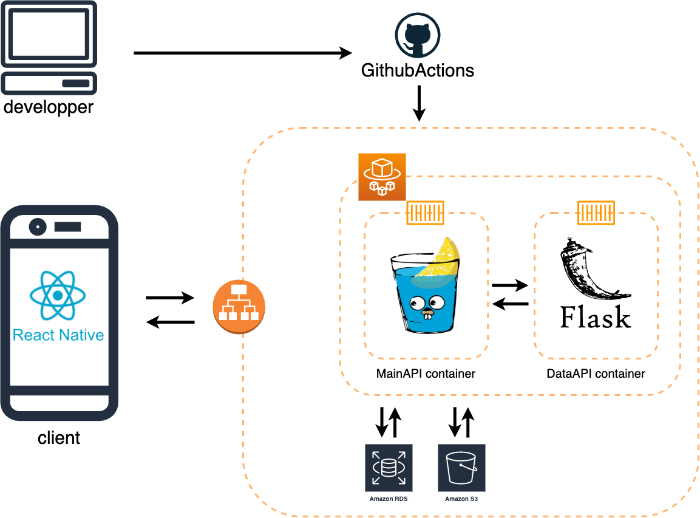

# MAPPIN

## 製品概要

**~思い出の軌跡を写真とともに~**

**動画** 
https://drive.google.com/file/d/10CbU1zVIcPXx3CqdFYB-f76UQ2YoPEG6/view?usp=sharing

**リポジトリ**  
クライアント: https://github.com/jphacks/D_2106_1  
バックエンド: https://github.com/jphacks/D_2106_2/tree/7148c06c7c9114d87edfc1de592be081588ddeea

### 背景(製品開発のきっかけ、課題等）

開発の動機は、「旅をより楽しんで欲しい」という思いです。

コロナが終息に向かっている今、旅に出て楽しい思い出を作りたい人は多いと思います。 
では、その思い出はどんな形で残しますか？ 
多くの人は、写真に残したり、SNS 上にアップロードして旅の思い出を共有したりするのではないでしょうか。 
僕たちは、そんな旅の思い出を記録できる新感覚 SNS アプリで、楽しい旅行をサポートします。

### 製品説明（具体的な製品の説明）

MAPPIN では旅の軌跡を素敵なアルバムとして作成します。  

MAPPIN で作成されるアルバムでは、旅の途中に撮影した写真とその位置情報が自動で紐付けられており、旅行の道のりとともに記録されます。 
アルバムを作成する過程やアルバムを見返すときに、実際の道のりともに写真を閲覧でき、旅の思い出に関する新しい体験が提供できると考えています。 
もちろん、作成されたアルバムは投稿することができます。 
他の人のアルバムも閲覧可能であり、さまざまな魅力的な写真や、まだ見たことのない穴場スポットの数々はあなたの旅行計画の大きな助けになるでしょう。 
 
思い出の写真を軌跡ともに。

### 特長

#### 1. 簡単なスワイプ動作でストレスなく思い出の写真を振り返る

アルバムに追加する写真を選ぶのもストレスフリーな設計となっています。

#### 2. 写真とともに旅の軌跡を振り返る

作成したアルバムには写真とともに旅の軌跡が記録されています。

#### 3. 他の人の旅の軌跡を閲覧

他の人の旅の軌跡も閲覧することができ、あなたの旅の計画の助けになるでしょう。

### 解決出来ること

MAPPIN を利用することで、旅の始まりから終わりまでの思い出を鮮明に思い出すことができます。 
このアプリでは、旅の途中で撮影された写真が道のりとともにアルバムとして作成されるため、写真単体で旅を振り返るよりもより多くの思い出が。 
また他の人が作成したアルバムも閲覧することができ、自分では気付かなかった穴場スポットや新しい観光の仕方など、あなたの旅を素晴らしいものにする様々な発見もあるかもしれません。 
また、理想のアルバムを作成したいという気持ちは、旅を計画する楽しさを何倍にも高めるでしょう。 

### 今後の展望

- ユーザの経路情報を集積して、機械学習によっておすすめのスポットやお店をリコメンドする機能を追加したい。
  - アルバム作成中の画面が、旅をナビゲーションしてくれるようになり、アプリの楽しさが増す。
  - 経営面を考えると、蓄積されたデータは、人気スポットの傾向を顕著に示すため、マーケティング等において非常に価値が高く、需要があると考えられる。
- SNS としての機能の充実させ、共有する楽しさを増やす。(フォローフォロワー機能やいいね,、リプ欄の追加)

### 注力したこと（こだわり等）

- MAP 背景を生かした洗練された独自 UI
  - 「探す」タブの、スクロール方向が上下、左右入れ替わるモーダル画面
  - アルバム作成中の画面における経路と写真のリアルタイム表示
- ストレスフリーな UI の作成
  - アルバムを作成する際に、入力しなければいけない情報を最低限に抑えた。( 地名や日時、経路情報は自動検出 )
- クラスタリング

## 開発技術

### 活用した技術

- 使用言語
  - Typescript
  - Go
  - Python
- インフラなど
  - Docker
  - AWS(fargate, RDS, S3)
  - Github Actions

#### API・データ

- [HeartRails Geo API](https://geoapi.heartrails.com/)

#### フレームワーク・ライブラリ・モジュール

- React
- Expo
- gin
- gorm
- flask
- scikit-learn

### 独自技術

#### ハッカソンで開発した独自機能・技術

- Tinder ライクな UI
- クラスタリングによる GPS データの集約
  - https://github.com/jphacks/D_2106_2/blob/7148c06c7c9114d87edfc1de592be081588ddeea/data_api/vizualize_api.ipynb
